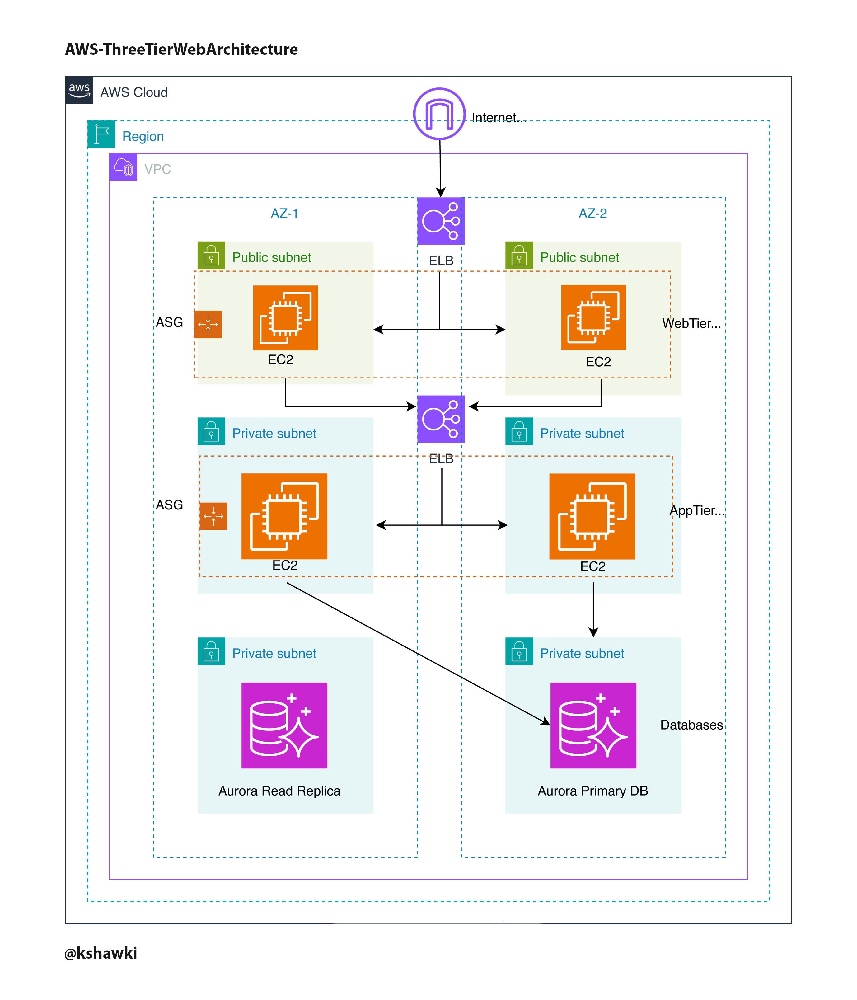

# Scalable Web Application with ALB and Auto Scaling

## Overview:

I designed and deployed this project to demonstrate a scalable, highly available three-tier web architecture using AWS services. The architecture includes a web tier, application tier, and database tier, utilizing AWS services like VPC, EC2, RDS, S3, and Load Balancers. This project helped me enhance my cloud architecture and deployment skills while focusing on security, scalability, and availability.

## Architecture Overview



## What I Did

### Web Tier


- Set up EC2 instances running Nginx to serve a React.js frontend.
- Configured a public Application Load Balancer (ALB) to distribute incoming traffic across the web servers.
- Enabled Auto Scaling Groups to ensure high availability during traffic spikes.

### Application Tier


- Developed and deployed a Node.js backend behind an internal ALB to manage API requests.
- Implemented secure traffic flow between the web tier and the backend using security groups.

### Database Tier


- Deployed an Amazon Aurora MySQL Multi-AZ instance for high availability and fault tolerance.
- Configured a DB subnet group and applied security group rules to restrict database access to the application tier.

### Networking & Security

- Designed a custom VPC with public and private subnets across multiple availability zones.
- Configured Route Tables, Internet Gateway, and NAT Gateway for efficient traffic routing.
- Applied IAM roles and Security Groups for fine-grained access control, following the principle of least privilege.

### S3 & IAM

- Created an S3 bucket for hosting static assets and granted secure access using IAM roles.
- Used Amazon SSM for secure instance management without the need for SSH keys.

## Setup Instructions

### Clone the Repository

```bash
git clone git@github.com:KShawki/AWSThreeTierWebArchitecture.git
```

## S3 Bucket Configuration

- Created a new **S3 bucket** for static asset hosting.

## IAM Role Configuration

- Created an **EC2 role** with:
  - `AmazonSSMManagedInstanceCore` for **Systems Manager** access.
  - `AmazonS3ReadOnlyAccess` to allow instances to **download code from S3**.

## Networking Setup

- Configured a **VPC** with public and private subnets in two availability zones.
- Set up **Route Tables**, **Internet Gateway**, and **NAT Gateway** for proper routing.
- Defined **Security Groups** to control traffic at each layer: web, application, and database tiers.

## Application Deployment

- Launched **EC2 instances** in the web and application tiers.
- Deployed:
  - **React.js frontend** on **Nginx** in the web tier.
  - **Node.js backend** in the application tier, connected to **Aurora MySQL**.

## Load Balancers & Autoscaling

- Configured **public** and **internal Application Load Balancers** to manage traffic.
- Set up **Auto Scaling Groups** to handle fluctuating workloads seamlessly.

## Testing

- Accessed the frontend via the **public ALB** to ensure smooth operation.
- Verified **database connectivity** by making API requests through the backend.

## Thank You! ❤️
